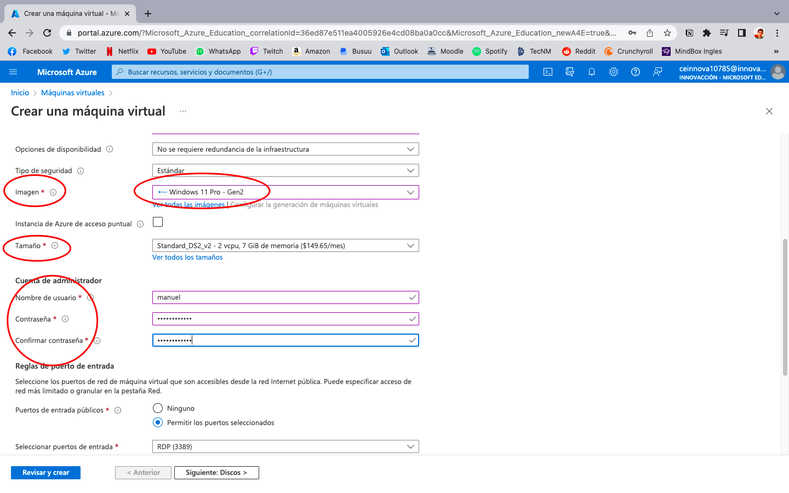

# Como hacer una máquina virtual en Microsoft azure

**» REQUISITOS**
- Tener cuenta y creditos en Micrososft Azure
- DEscargar la aplicación **Microsoft remote desktop**

**» Pasos**
1.- Entramos al portal de [Microsoft azure.](https://portal.azure.com/?Microsoft_Azure_Education_correlationId=36ed87e511ea4005926e4cd08ba0a0cc&Microsoft_Azure_Education_newA4E=true&Microsoft_Azure_Education_asoSubGuid=79443659-2beb-4414-bdc9-5d1787297ca7#home)

2.- Una vez dentro, en la barra de busqueda escribimos **VIRTUAL MACHINE.**
3.- Despues, nos llevara a otra página.
4.- Cuando nos lleve a la siguiente página, en la parte superior izquierda, nos aparecera un recuadro que dice **crear**, el cual procedermos a picarlo.

5.- Se desplegara un menú con distintas opciones, en nuestro caso unicamente seleccionaremos la primera que dice **Maquina virtual de azure.**

6.- Nos llevará a una página distinta, donde tendremos que llenar algunos datos.

**NOTA:** Lo que necesita cualquier recurso de azure para que funcione es un **una suscripción, un grupo de recursos, un nombre de máquina virtual y una región.**

7.- En el apartado de imagen podremos seleccionar distintos sistemas operativos en los que nuestra máquina virtual podra iniciar, para este ejemplo usaremos windows.
8.- Dependiendo de la región podremos elegir entre distintos tamaños que vendria siendo las caracteristicas que nuestra maquina virtual tendria.
9.- Tambien crearemos un usuario y una contraseña, las cuales nos ayudaran a iniciar nuestra maquina virtual.

10.- Una vez hecho esto, unicamente tendremos que darle al boton de crear y tendremos lista nuestra primera máquina virtual.

--------------------------------------------------------

**Creación de una segunda máquina virtual para conectarlas**

1.- Realizaremos los mismos pasos de creación de una máquina virtual citados con anterioridad.
2.- En esta segunda máquina, nos aseguraremos que en la parte de red virtual tengamos el mismo nombre del grupo de recursos con la palabra **-vnet** al final.
3.- Tambien nos aseguraremos de tener el grupo de seguridad seleccionado donde dice **ninguno.**

4.- Le daremos en crear y tendremos nuestra segunda máquina virtual.
**Pasos para abrir las máquinas virtuales**
5.- Ahora, en el buscador, nos iremos a el apartado de grupo de recursos.

8.- Entraremos a la que dice sesión 4.
9.- Nos llevará a la siguiente ventana y ahi presionamos el icono del monitor con el nombre de nuesstra primera máquina virtual.

10.- Una vez realizado lo anterior, en la parte superior izquierda presionaremos el icono que dice **conectar** y el que dice **RDP.** 

11.- Nos llevará al siguiente lugar, donde apretando el botón **Descargar archivo RDP** se bajará el archivo que nos permitirá abrir la máquina virtual 1.

12.- Con la ayuda de la aplicación **Escritorio remoto de Microsoft** podremos visualizar nuestras máquinas virtuales. :)

**Extra**: Para terminar tenemos que ingresar el usuario y contraseña anteriormente creadas para poder iniciar la computadora.

--------------------------------------------

**Pasos para abir la segunda máquina virtual**

1.- Abrimos el cmd dentro de nuestra máquina virtual.

2.- Regresamos a Azure para copiar la IP que se encuentra en nuestra segunda máquina virtual.

3.- En el cmd escribimos **mstsc /v:10.0.0.5**
4.- Ahí podremos ingresar nuestro usuario y contraseña y tendremos lista nuestra segunda máquina virtual abierta.

**LISTO!!! TENEMOS ABIERTAS NUESTRAS DOS MÁQUINAS VIRTUALES :)**# VirtualMachineAzure
# VirtualMachine
